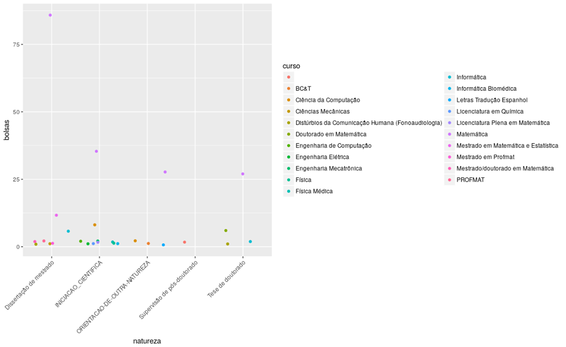

```{r libraries, echo=FALSE, results='hide'}
library(jsonlite)
library(readxl)
# library(tidyr)
library(reshape2)
suppressMessages(library("tidyverse"))
setwd("~/Documentos/UnB/Listas e Trabalhos/Data Science/Relatório 3")
```


```{r setup, include=FALSE}
knitr::opts_chunk$set(echo = TRUE)
```

## Introdução
Este relatório tem como foco principal a contextualização das áreas de pesquisa relacionadas ao programa de Pós-Graduação em Matemática da UnB, dos anos 2010 à 2017. Para tal está sendo apresentado dados de produção científica dos docentes do programa, retirados do currículo Lattes dos professores e do repositório `OASIS` do `IBICT` (Instituto Brasileiro de Informação em Ciência e Tecnologia). 

O programa de pesquisa utilizado neste relatório é o de Matemática (código: `53001010003P2`). O coordenador é o Carlos Alberto Pereira dos Santos e as subáreas de concentração são: **Álgebra, Análise, Geometria e Matemática Aplicada**. Mais informações do programa podem ser acessadas pelo site [sucupira](https://sucupira.capes.gov.br/sucupira/public/consultas/coleta/programa/viewPrograma.jsf?popup=true&cd_programa=53001010003P2).

O programa de Pós-Graduação em Matemática da UnB, iniciado em 1962, oferece Mestrado e Doutorado em Matemática nas subáreas de Álgebra, Análise, Geometria e Matemática Aplicada (Probabilidade, Física-Matemática e Computação). O corpo docente mantém um programa ativo de pesquisa, participa regular e ativamente de forma destacada em reuniões científicas e em corpos editoriais de revistas científicas, além de manter intercâmbio científico com diversas instituições do país e do exterior. 

Há também um programa de mestrado profissional `PROFMAT`, que é um programa de pós-graduação stricto sensu em Matemática, reconhecido pelo Ministério da Educação e conduzindo ao título de Mestre. Tem como objetivo proporcionar formação matemática aprofundada relevante ao exercício da docência no Ensino Básico, visando dar ao egresso a qualificação certificada para o exercício da profissão de professor de Matemática.

O `PROFMAT` é um curso semipresencial ministrado por Instituições de Ensino Superior associadas em uma Rede Nacional, no âmbito do **Sistema Universidade Aberta do Brasil** (UAB). É coordenado pela Comissão Acadêmica Nacional, que opera sob a égide da Diretoria da **Sociedade Brasileira de Matemática** (SBM).

As Instituições de Ensino Superior que integram a Rede Nacional do `PROFMAT` são denominadas Instituições Associadas e são responsáveis, por intermédio das respectivas Coordenações Acadêmicas Institucionais, por toda a gestão local do `PROFMAT`, descritas no Regimento. Informações completas sobre este mestrado podem ser encontradas na página do [`PROFMAT`](http://www.profmat-sbm.org.br). Na Universidade de Brasília este curso é ofertado no âmbito do Instituto de Ciências Exatas, Departamento de Matemática.

O Departamento de Matemática da UnB obteve nota 7 na última avaliação trienal da Capes. Essa avaliação de excelência é o resultado de um longo, árduo e contínuo trabalho iniciado em 1962 por professores/colaboradores corajosos e idealistas que acreditaram em tornar o sonho do Departamento de Matemática da Universidade de Brasília uma realidade. Desde então, esse ideal vem sendo fortalecido com a chegada de novos professores/colaboradores que conduziram este programa ao reconhecimento da sua excelência.

## Contextualização
```{r pesquisadores_por_area}
pesquisadores_por_area <- fromJSON("Matematica.researchers_by_area.json")
sapply(pesquisadores_por_area$`Areas dos pesquisadores`, length)
```

Analisando os DataSets do programa de Pós-Graduação em Matemática disponibilizados, podemos observar que há um total de 6 áreas dos pesquisadores: Ciência da Computação, Física, Engenharia Aeroespacial, Matemática, Engenharia Biomédica e Probabilidade e Estatística. Com um total de 4, 1, 1, 40, 1 e 2 pesquisadores em cada uma das 6 áreas, respectivamente. Também, é possível observar um total de 546 orientações de 2010 à 2017. Sendo 104 orientações concluídas em mestrado, 104 em doutorado e 104 em pós doutorado; e 26 em andamento de pós doutrado, 78 em doutorado e 26 em mestrado. Também temos 104 outras orientações concluídas.

As principais linhas de pesquisa e alguns pesquisadores, de acordo com o [site](http://mat.unb.br/pagina/pos-sobre) do programa, são listados abaixo:

* Álgebra;
* Análise;
* Geometria Diferencial
    + **Keti Tenenblat**: Professora **emérita** da Universidade de Brasília.
* Matemática Aplicada;
* Probabilidade;
* Teoria dos Números
    + **Diego Marques Ferreira**: Teoria Transcendente, Equações Diofantinas;
    
    + **Hemar Teixeira Godinho**: Equações Diofantinas, Teoria Aditiva dos Números;
* Sistemas Dinâmicos
    + **Lucas Conque Seco Ferreira**: Dinâmica Topológica, Dinâmica com Simetrias, Geometria e Topologia da Variedade e de Espaços Homogêneos, Análise Numérica;
    
    + **Mauro Moraes Alves Patrão**: Dinâmica Topológica, Teoria Ergódica, Dinâmica com Simetrias, Geometria de Espaços Homogêneos, Análise Numérica;
  
Tem-se um total de 162 participações em eventos do ano de 2010 à 2017, sendo 74 deles no Brasil e 38 nos Estados Unidos. Os principais periódicos de publicações dos artigos aceitos são:

* International Journal of Group Theory
* Granular Matter (Print)
* Journal of Mathematical Fluid Mechanics
* COMMUNICATIONS IN ALGEBRA
* MONATSHEFTE FUR MATHEMATIK
* TRANSACTIONS OF THE AMERICAN MATHEMATICAL SOCIETY

Os anos destes periódicos são: 2013, 2016 e 2017.

## Referencial
De acordo com Ricardo Barros Sampaio e Jorge Henrique Cabral Fernandes, “A ciência pode ser definida como o estudo metodicamente organizado de qualquer fenômeno que ocorre no universo, com finalidade de explicar e prever o comportamento e a estrutura de tal fenômeno”. O seguinte trabalho visa o estudo de tudo aquilo que é produzido cientificamente pela universidade (ciência da ciência) e qual a relevância destas descobertas para os próprios pesquisadores e alunos, com o intuito de validarem o método que utilizam e a qualidade daquilo que vem sendo criado.

A mais antiga das ciências da ciência é a filosofia. A tarefa da filosofia consistiu, durante séculos, em estabelecer o melhor método do conhecimento verdadeiro, e depois aplicá-lo para o entendimento do mundo, da religião e da moral. A ciência da ciência é hoje uma atividade multi-disciplinar, com muitas abordagens distintas.

O pensamento lógico já se demonstrou ineficiente para criação de teorias científicas e para descrever a natureza. René Descartes, já afirmava que: ``Matemática é uma ferramenta para se fazer ciência, mas não é uma ciência''. Isso ocorre, pois palavras e números não existem na natureza, portanto não são ciência. Mas, a matemática já se mostrou ótima ferramenta para o estudo e formulação de teorias científicas.

A Matemática é essencial para muitas ciências. A função mais importante da Matemática na ciência é o papel que ela possui na expressão de modelos científicos. Medidas de coleta e observação, bem como hipotetizar e prever, geralmente requerem modelos matemáticos e um extensivo uso da Matemática. Os ramos matemáticos mais utilizados na ciência incluem o cálculo e a estatística, apesar de virtualmente cada ramo da Matemática ter aplicações, mesmo áreas "puras" tais como a teoria numérica e a topologia. A Matemática prevalece mais na Física, e menos em Química e algumas ciências sociais.
Alguns pensadores vêem os matemáticos como cientistas, considerando os experimentos físicos como não essenciais ou as provas matemáticas como equivalentes a experimentos. Outros não vêem a Matemática como ciência, já que ela não requer teste experimental de suas teorias e hipóteses. Em qualquer caso, o fato de que a Matemática é uma ferramenta útil na descrição do universo é uma questão da Filosofia da Matemática.
Richard Feynman disse: "A Matemática não é real, mas se sente real. Onde é esse lugar?", enquanto que a definição favorita de Bertrand Russell sobre a Matemática é ``o assunto no qual nunca sabemos do que estamos falando nem se o que estamos dizendo está certo.'' 

O programa de pós-graduação sendo avaliado gerou ao longo dos anos diversos subprodutos que são consequências direta da atividade cientifica como por exemplo publicações e ou orientações acadêmicas que podem ser avaliadas para gerar um feedback qualitativo sobre o programa. Algumas questões devem ser levantadas ao realizar estes estudos, entre elas como definir uma métrica para o que está sendo avaliado? Sabemos que grande
parte das bases de dados internacionais indexam apenas pesquisas realizadas em língua inglesa, portanto como é possível avaliar o impacto internacional do que é produzido no país?

Estas questões são discutidas e exploradas na ciência da ciência poís devemos ser capazes de medir e validar o impacto do que é produzido em nossas universidade e como é possível melhorar o que vem sendo produzido.
Existem grupos de pesquisa como por exemplo o Science and Evaluation Studies(SES) que se dedicam exclusivamente ao estudo de métricas de avaliações de pesquisas cientificas.

A plataforma Lattes vem com o objetivo de auxiliar nos estudos acerca da produção realizada na universidade. Diversos conjuntos de dados acadêmicos são agregados com o intuito de gerar um material organizado e padronizado para que outros usuários possam disfrutar destas informações. Os estudos aqui realizados se baseiam nos conjuntos de dados fornecidos a respeito de publicações, orientações e perfis agregados pela própria plataforma
do Lattes que se tornou bastante relevante no momento de definir nossas métricas de avaliação.

## Metodologia
A metodologia utilizada tenta seguir o que é proposto pelo modelo CRISP-DM. Inicialmente o contexto do programa de pós-graduação foi explorado, buscando o máximo possível de informações sobre o PPG incluindo seu funcionamento e suas áreas de pesquisa. Os dados foram buscados e explorados a partir do website do programa com o intuito de compreender melhor o contexto que será trabalhado.. Os dados utilizados para pesquisa foram tirados do dataset de publicações, orientações e perfis da Matemática do portal do programa e do [elattes](http://unb.elattes.com.br/user/login).

Uma vez compreendido do que se trata o programa os dados dispostos pelo E-Lattes foram explorados para
um reconhecimento inicial. Pode-se notar que os dados vieram em formato JSON, englobando os universos de
publicações, orientações, perfis e áreas de pesquisa dos orientadores do departamento, além dos dados referentes as
bases do DGP e OASIS. Após importação devida os dados passaram por uma exploração inicial para entender sua
formatação e se alguma modificação seria necessária para trabalhar com as ferramentas disponíveis framework da
linguagem R.

Os dados constituem informações sobre os orientadores do departamento o que inclui, senioridade,
produções, endereço profissional, produção bibliográfica e orientações que os mesmos realizaram. Também
podemos identificar informações sobre as orientações realizadas pelo departamento que incluem informações sobre
o aluno sendo orientado, como curso, instituição, nome dos orientadores, título da orientação, ano e qual estado se
encontra a orientação, em andamento ou concluída. Por último temos os dados de publicações que englobam 6 tipos
de publicações que serão detalhadas nos resultados obtidos.

Em seguida foi identificado que alguns dados não estavam totalmente preparados para a realização de buscas,
uma vez que é necessária a formatação em tabelas (e não em listas) para a realização de filtragens e joins de maneira
clara prática. Portanto os arquivos de publicações e perfis foram modificados para que fossem removidas algumas
listas internas a estruturam que dificultavam sua utilização. Por exemplo, no arquivo de publicações, temos uma grande lista com 7 outras listas como elementos: periódico, livro, capítulo de livro, texto em jornais, evento, artigo aceito e demais tipos de produação bibliográfica.

Tendo os dados filtrados e organizados foram efetuadas consultas básicas com o intuito de ter uma
visualização mais clara dos conjuntos de dados. As bibliotecas utilizadas para filtragem e visualização foram a `dplyr`,
que permitem consultas semelhantes a consultas de bancos de dados, com dados organizadas em tabelas (em R
conhecidas como dataframes), e a biblioteca `ggplot2` que possibilita a fácil criação de gráficos a parir de dataframes.

Após a realização das consultas foram geradas algumas conclusões que foram cruzadas com os dados iniciais
obtidos a partir da avaliação do contexto do programa, apesar de o trabalho ter caráter expositivo foi gerado um
modelo para tentar explicar algumas situações identificadas ao longo da pesquisa do PPG. O procedimento aqui
demonstrado foi repetido até que fossem obtidos resultados satisfatórios assim como descreve o modelo CRISP-DM.

## Resultados
Para o DataSet profile de Matemática foi utilizado `fromJSON` para importar `Matematica.profile.json` recebendo a estrutura na variável `perfis`.
Com o comando `length(names(perfis))` recebemos o valor de 44, o que indica o números e professores no departamento de matemática. Para fins de análise utilizaremos a quantidade de orientações de cada tipo que cada professor fez até o momento da extração dos dados.
Após uma série de tratamentos da tabela demonstrados nos passos abaixo foi possível separar o número de tipos de orientações por professor. Assim, por motivos de vizualização pegamos os 25 professores com maior número de orientações e inserimos em um gráfico de barras, apresentado logo abaixo.

```{r perfis, echo = FALSE, results='hide'}
perfis <- fromJSON("Matematica.profile.json")
orient_prof_perfis <- lapply(perfis, function(x) x$orientacoes_academicas)
tipos_orientacoes <- unique(unlist(sapply(orient_prof_perfis, function(x) names(x))))
table_orientacoes <- data.frame(matrix(ncol = 7, nrow = 0))
colnames(table_orientacoes) <- tipos_orientacoes

for(prof in perfis){
  aux <- prof$orientacoes_academicas
  total <- lapply(aux, function(x) length(x$titulo))
  total <- append(total, list(nome = prof$nome))
  table_orientacoes <- bind_rows(table_orientacoes, total)
}
total <- rowSums(table_orientacoes[,1:ncol(table_orientacoes)-1], na.rm=TRUE)

table_orientacoes <- bind_cols(table_orientacoes, total = total)
table_orientacoes <- arrange(table_orientacoes, desc(total))
table_orientacoes <- melt(head(table_orientacoes[,1:ncol(table_orientacoes)-1], 25))
table_orientacoes$variable <- sub("_", " \n", table_orientacoes$variable)
table_orientacoes$nome <- gsub("^((\\w+\\W+){1}\\w+).*$","\\1", table_orientacoes$nome)


ggplot(table_orientacoes, aes(x=nome, y=value, fill=variable)) +
  geom_col() +
  theme(axis.text.x = element_text(angle = 45, hjust = 1)) +
  ylab("Quantidade de orientações") +
  xlab("Nome do professor") +
  guides(fill=guide_legend(keywidth=0.2, keyheight=0.4, default.unit="inch"))
```

O professor com o maior número de orientações foi o [Maurício Ayala](http://www.mat.unb.br/ayala/), pode-se notar uma grande diferença entre o número de orientandos dele e dos outros orientadores.

Para publicações podemos obter um total de 162 publicações usando o código abaixo. Usando `pub.df$autores` obtém-se como resultado apenas 6 autores com artigos aceitos. Dentre eles, dois estão no gráfico apresentado anteriormente: Yuri Dumaresq e Alexei. 

Além disso, podemos notar que temos um maior número de publicações em eventos, artigos e capítulos de livro. Participações em eventos geralmente evidenciam algum tipo de engajamento dos pesquisadores com as comunidades externas à universidade e podem trazer informações importantes sobre o quanto determinado departamento influencia ou é influenciado por outras comunidades.

```{r publicacoes}
publicacoes <- fromJSON("Matematica.publication.json")

x = c()
for (i in publicacoes) {
  x <- append(sum(sapply(i, length)), x)
}

data.frame(numero_pesquisas = x, ano = names(publicacoes)) %>%
  ggplot(aes(x = "", y = numero_pesquisas, fill = ano)) +
  geom_bar(width = 1, stat = "identity") +
  geom_text(aes(label = paste0(round(numero_pesquisas), "")), 
            position = position_stack(vjust = 0.5)) +
  coord_polar("y") +
  theme_void()
```

A seguir, temos dois gráficos que mostram o número de eventos de acordo o ano e país do evento. Podemos notar que o PPG participou de um maior número de eventos em 2014, 2012 e 2011, respectivamente. O que indica uma queda considerável no número de participações. Também podemos perceber que o PPG participa de vários eventos nos Estados Unidos e que há um número considerável de artigos aceitos que pode ser tanto em eventos/periódicos nacionais quanto internacionais.

Usando `length(unique(pub.df3$periodico))` obtemos como resposta 243, um número grande de publicações em periódicos **diferentes** de Matemática. 

Esses dados indicam um grau considerável de intercionalização do programa uma vez que o segundo país com maior número de participação de eventos de membros do programa é o Estados Unidos - 38 - e não há barreiras linguísticas para as publicações, visto que boa parte de suas produções são em periódicos internacionais . 

```{r publicacoes2, results='hide'}
pub.df <- data.frame()
for (i in 1:length(publicacoes$ARTIGO_ACEITO))
   pub.df <- rbind(pub.df, publicacoes$ARTIGO_ACEITO[[i]])
glimpse(pub.df)
unique(pub.df$ano)

pub.df2 <- data.frame()
for (i in 1:length(publicacoes$EVENTO))
  pub.df2 <- rbind(pub.df2, publicacoes$EVENTO[[i]])
glimpse(pub.df2)

pub.df2 %>%
  group_by(pais_do_evento, ano_do_trabalho) %>%
  summarise(eventos = n()) %>%
  arrange(desc(eventos)) %>%
  ggplot(aes(x = ano_do_trabalho, y = eventos, col = pais_do_evento, 
             group = pais_do_evento)) +
  geom_point() +
  geom_line()

pub.df2 %>%
  group_by(pais_do_evento) %>%
  summarise(eventos = n()) %>%
  arrange(desc(eventos)) %>%
  ggplot(aes(eventos, fill = pais_do_evento)) +
  geom_histogram(aes(y = ..density..), binwidth = 30)

pub.df3 <- data.frame()
for (i in 1:length(publicacoes$PERIODICO))
   pub.df3 <- rbind(pub.df3, publicacoes$PERIODICO[[i]])
glimpse(pub.df3)
length(unique(pub.df3$periodico))
```

No gráfico abaixo temos o número de bolsistas do programa. Boa parte das bolsas se concentram no grupo que está fazendo dissertação de mestrado, o que já era de se esperar pois há um maior número de Mestrandos do que de Doutorandos, analisando o DataSet **OASIS**.
<center></center>

Além disso, 2014 foi o ano com o maior número de bolsistas: 47 do total de 236 bolsas avaliadas desde 2010. O número de bolsas sofreu um grande aumento em relação à anos anteriores, o que indica crescimento e desenvolvimento do programa desde 2010. Entretanto, em 2017 este número caiu para 29. Que pode ser interpretado como uma reflexão do menor número de mestrandos no programa ou um menor número de bolsas disponíveis. 

O ano de 2014 também foi o ano com resultados mais expressivos para publicações do programa, conforme comentado anteriormente. Isso nos mostra uma relação direta entre o número de bolsas para orientações e publicações. 

```{r orientacoes, echo=FALSE, results='hide'}
orientacoes <- fromJSON("Matematica.advise.json")
names(orientacoes)
# orientacoes <- orientacoes[-4:-5] # Tirar dados da Graduação
names(orientacoes)

sum(sapply(orientacoes$ORIENTACAO_EM_ANDAMENTO_DE_POS_DOUTORADO, length))
sum(sapply(orientacoes$ORIENTACAO_EM_ANDAMENTO_DOUTORADO, length))
sum(sapply(orientacoes$ORIENTACAO_EM_ANDAMENTO_MESTRADO, length))

sum(sapply(orientacoes$ORIENTACAO_CONCLUIDA_POS_DOUTORADO, length))
sum(sapply(orientacoes$ORIENTACAO_CONCLUIDA_DOUTORADO, length))
sum(sapply(orientacoes$ORIENTACAO_CONCLUIDA_MESTRADO, length))

ori.df <- data.frame()
for(i in orientacoes) {
  for(j in i) {
    ori.df <- rbind(ori.df, j)
  }
}

glimpse(ori.df)
unique(ori.df$natureza)
unique(ori.df$curso)

ori.df$curso <- 
  ori.df$curso %>%
    str_replace_all("Dotorado em matemática", "Doutorado em Matemática") %>%
    str_replace_all("Doutorado em Matematica", "Doutorado em Matemática") %>%
    str_replace_all("Doutorado em matemática", "Doutorado em Matemática") %>%
    str_replace_all("Matematica", "Matemática") %>%
    str_replace_all("matemática", "Matemática") %>%
    str_replace_all("matematica", "Matemática") %>%
    str_replace_all("Ciências da Computação", "Ciência da Computação")

# ori.df %>%
#   filter(bolsa == "SIM") %>%
#   group_by(natureza, curso) %>%
#   summarise(bolsas = n()) %>%
#   arrange(desc(bolsas)) %>%
#   ggplot(aes(x = natureza, y = bolsas, col = curso)) +
#   geom_jitter() + 
#   theme(axis.text.x = element_text(angle = 45, hjust = 1))

``` 

É importante também notar que o programa possui um grande grau de colaboração entre seus participantes
uma vez que a maior parte das publicações são realizadas em grupos, assim como as produções literárias e artigos
produzidos. Também foram observadas mudanças nas produções do departamento ao longo dos últimos anos que
podem ser analisadas mais a fundo, aqui foi proposta uma relação com cortes de fundos (como nas bolsas) mas que devem ser avaliados
traçando relações com informações sobre o cenário brasileiro.

